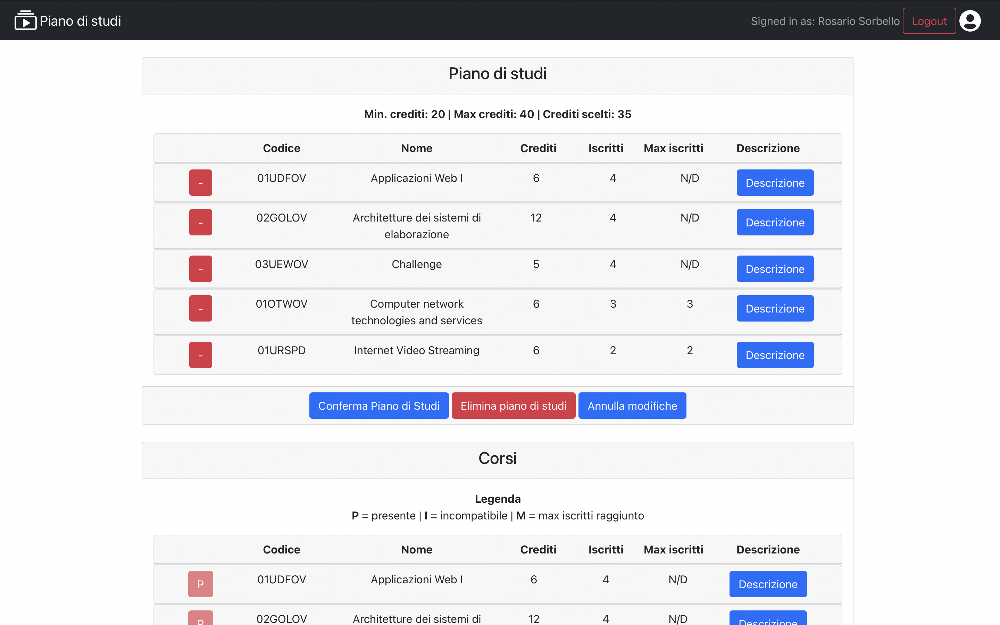

# Project Name: Study Plan

## Author：ZHANG YUEXIN

## React Client Application Routes

To test it, there are few quick steps to do:
* cd into `server` -> `npm install`
* run `nodemon index.js`
* move into `client` -> `npm install`
* run `npm start`

- Route `/`: contains a list of all available courses, with relative descriptions that can be expanded from the button.

- Route `/home`: contains both the list of available courses (marked according to their status as can be seen from the legend (**P** = present in the study plan, **I** = incompatible, **M** = maximum enrollment reached ) with related descriptions that can be expanded from the button, and a "Study plan" section.<br/>In the latter, if it exists, a study plan appears (in Full Time/Part Time mode) with the heading the related maximum credits, minimum and present in the list of the user's study plan, otherwise the user is asked to create one by clicking on the relative Full Time or Part Time buttons.<br/>N.B. To create the study plan it is not enough to click on the buttons mentioned in precedence, but it is necessary to respect the credit constraints.

- Route `/login`: login page, where there is a form where you can put your username and password. The login action will be triggered by a button which, if successful, refers to the `/home` page, displaying a confirmation toast. If the username is not validated, it will be notified on the field itself, while if the validation passes all checks and the user does not exist, a toast will appear with an error message.

## API Server

### Cources

#### GET `/api/courses`

* Returns the generic list of courses
* **Request header has a line**: `Content-Type: application/json`
* **Request body**: empty
* **Request response**: `200 OK` (success); body: array of objects, and each of them has id, name, max_students, propaedeuticity, cfu, enrolled, incompatibles.
* **Response body**:

```
[
  ...,
  {
    "id": "01SQMOV",
    "name": "Data Science e Tecnologie per le Basi di Dati",
    "max_students": null,
    "propedeuticity": null,
    "cfu": 8,
    "enrolled": 0,
    "incompatibles: ["01SQJOV", "01SQLOV"]
  }
]
```

* **Error responses**:  `500 Internal Server Error` (generic error).

### Study Plan

#### GET `/api/studyPlan/:student_id`

* Returns the list of courses in the user's study plan
* **Request header**: `req.params.student_id` to receive the study plan related to the student, and has a line `Content-Type: application/json`
* **Request body**: empty
* **Request response**: `200 OK` (success); body: array of objects, and each of them has id, name, max_students, propaedeuticity, cfu, enrolled, incompatibles.
* **Response body**:

```
[
  ...,
  {
    "id": "01SQMOV",
    "name": "Data Science e Tecnologie per le Basi di Dati",
    "max_students": null,
    "propedeuticity": null,
    "cfu": 8,
    "enrolled": 0,
    "incompatibles: ["01SQJOV", "01SQLOV"]
  }
]
```

* **Error responses**:  `401 Unauthenticated user` (not logged in or wrong permissions), `500 Internal Server Error` (generic error).

#### POST `/api/addToStudyPlan/:student_id/:isFullTime`

* Update the study plan for the user corresponding to `student_id`, and if no study plan exists, create it by changing the user's `isFullTime` flags.
* **Request header**: `req.params.student_id` to update the student's study plan, `req.params.isFullTime` to create a part-time or full-time study plan if it does not exist -time, and has a `Content-Type: application/json` line
* **Request body**:

```
[
  ...,
  {
    "id": "01SQMOV",
    "name": "Data Science e Tecnologie per le Basi di Dati",
    "max_students": null,
    "propedeuticity": null,
    "cfu": 8,
    "enrolled": 0,
    "incompatibles: ["01SQJOV", "01SQLOV"]
  }
]
```

* **Request response**: `201 created` (success); body: empty.
* **Response body**: empty

* **Error responses**: `401 Unauthenticated user` (not logged in or wrong permissions), `422 Validation Error` (validation of body, parameters, credit constraints and subscribers failed), `500 Internal Server Error` generic).

#### DELETE `/api/deleteStudyPlan/:student_id`


* Delete the study plan for the user corresponding to `student_id`.
* **Request header**: `req.params.student_id` to delete the study plan related to the student, and has a line `Content-Type: application/json`
* **Request body**: empty
* **Request response**: `201 No content` (success); body: blank.
* **Response body**: empty

* **Error responses**: `401 Unauthenticated user` (not logged in or wrong permissions), `422 Validation Error` (validation of `student_id` failed), `500 Internal Server Error` (generic error).

### Sessione

#### GET `/api/sessions/current`

* Check if the user is logged in or not
* **Request header has a line**: `Content-Type: application/json`
* **Request body**: empty
* **Request response**: `200 OK` (success); body: .
* **Response body**: empty

* **Error responses**:  `401 Unauthenticated user` (not logged in or wrong permissions), `500 Internal Server Error` (generic error).

#### POST `/api/sessions`

* Effettua il login
* **Request header has a line**: `Content-Type: application/json`
* **Request body**:

```
{
  "username": "testuser@polito.it",
  "password": "testpassword"
}
```

* **Request response**: `200 OK` (success); body: un oggetto contenente id, username, name, isFullTime, hasStudyPlan.
* **Response body**: 

```
{
  id: 4,
  username: 'testuser@polito.it',
  name: 'Rosario Sorbello',
  isFullTime: 0,
  hasStudyPlan: 1
}
```

* **Error responses**:  `401 Unauthenticated user` (not logged in and/or invalid credentials), `500 Internal Server Error` (generic error).

#### DELETE `/api/sessions/current`

* Effettua il logout
* **Request header has a line**: `Content-Type: application/json`
* **Request body**: vuoto

* **Request response**: `200 OK` (success); empty.
* **Response body**: vuoto

* **Error responses**:  `401 Unauthenticated user` (not logged in and/or invalid credentials), `500 Internal Server Error` (generic error).

## Database Tables

- Table `users` - contains: id, email, name, surname, isFullTime, hasStudyPlan, hash, salt.
- Table `courses` - contains: id, name, max_students, propedeuticity, cfu.
- Table `study_plan` - contains: student_id, course_id. (Bridge Table)
- Table `incompatibles` - contains: course_id, incompatible. (Bridge Table)

## Main React Components

- `Courses` (in `CourseList.js`): contains `CourseTable` and a legend if the user is logged in (**P** = present | **I** = incompatible | **M** = max subscribers reached)

- `CourseTable` (in `CourseList.js`): contains a list of `CourseRow` and a header of their values: *code, name, credits, enrolled, max enrolled, description*.

- `CourseRow` (in `CourseList.js`): contains the course information, of which the last two appear pop-up by clicking the Description button: *code, name, credits, enrolled, max enrolled, incompatible, preparatory*.< br/> Allows you to expand a description containing the incompatible courses and the relative preparatory thanks to the button of the `CustomToggle` component.<br/>In particular, if the user is logged in, it brings up buttons on the left, which are blue with + if they allow the addition in the study plan, otherwise red and disabled in which initials appear according to a legend that appears in the `Courses` component, as seen above.

- `CustomToggle` (in `CourseList.js`): manages the toggle of the accordion allowing to replace the default behavior of the latter with the click of a button.

- `StudyPlan` (in `StudyPlan.js`): appears only if the user is logged in. If the user does not have a study plan, two buttons appear to ask whether you want to create a study plan in full time or part time mode, and then a row appears with max-min valid credits in order to confirm the study plan and the sum of credits made on the courses entered. Furthermore, 3 buttons appear at the bottom of the component: "Confirm Study Plan", "Delete Study Plan", "Cancel Changes" (the latter appears only in the case of temporary changes made to the study plan). <br/> If the study plan is already present, both the header and the line appear as previously mentioned, plus `SPTable`.

- `SPTable` (in `StudyPlan.js`): contains a list of `SPRow` and a header of their values: *code, name, credits, subscribers, max subscribers, description*.

- `SPRow` (in `StudyPlan.js`): contains course information, of which the last two appear pop-up by clicking the Description button: *code, name, credits, enrolled, max enrolled, incompatible, preparatory*. <br/> There is a red button with the sign '-' which allows you to remove the course from `SPTable`.

- `MyNavbar` (in `MyNavbar.js`): navbar containing a login/logout button with a user icon next to it, the application title with a book icon.

## Screenshot



## Users Credentials

N.B. The password is the same for all users and already appears as a default placeholder in the login, done specifically to avoid entering it manually for testing.

| Username | Password | Signed up | Membership type |
|:--------:|:--------:|:--------:|:--------------:|
| testuser@polito.it | testpassword | Yes | Part-time |
| u2@p.it | testpassword | Yes | Part-time |
| u3@p.it | testpassword | Yes | Part-time |
| u4@p.it | testpassword | No |     /     |
| u5@p.it | testpassword | Yes | Full-time |
